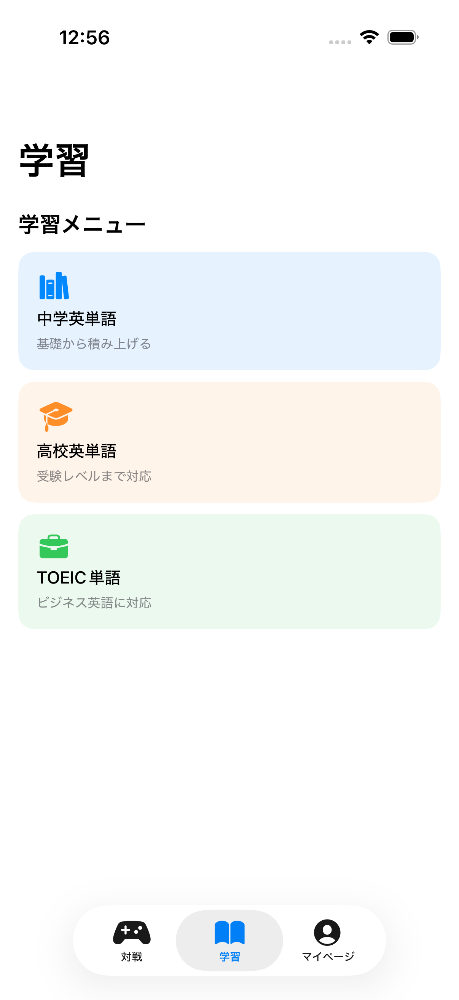
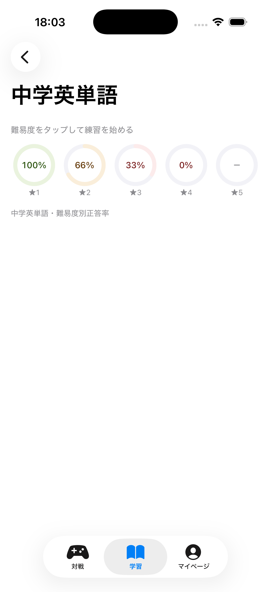
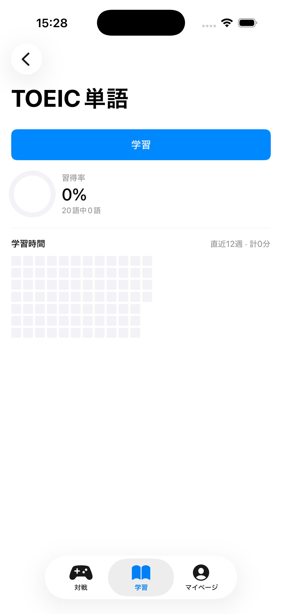

# スタはや

**勉強を、友達との早押し対戦にする iOSアプリ。**

英単語・TOEIC・SPIなどの学習コンテンツを、文字送り型の早押しクイズで出題する。友達とのオンライン対戦、CPU対戦、一人練習のいずれでも、解いた問題は同じ学習履歴・復習リストに積み上がる。

App Store公開に向けて2人で開発中(iOS 17以上 / SwiftUI / Firebase)。

| | | |
|---|---|---|
|  |  |  |
| 学習タブ | 難易度別の到達度 | カテゴリ別の学習量 |

---

## なぜ作ったか

資格試験・受験・SPIの勉強は一人では続かない。一方で「みんなで早押しクイズ」のような対戦アプリは高い継続性を実現しているが、コンテンツは雑学中心で学習には使えず、復習も学習履歴も残らない。

**対戦の楽しさと学習の積み上げは、まだ両立されていない。** そこを埋めるアプリとして設計した。詳細は [要件定義書](要件定義書_勉強系早押し対戦アプリ.md)。

## 主な機能

| 機能 | 内容 |
|---|---|
| **オンライン対戦** | ルームコードで友達と対戦。問題文が時間経過で徐々に表示され、選択肢のタップが早押しと回答を兼ねる |
| **CPU対戦** | Firebase不要・完全オフラインで動作。オンラインと同じルール・同じ画面 |
| **一人練習** | 中学英単語 / 高校英単語 / TOEIC / SPI |
| **復習リスト** | 間違えた問題が自動で蓄積される。対戦・練習のどちらで解いても同じリストへ |
| **学習履歴** | 難易度別の到達度、カテゴリ別の学習量、学習時間のヒートマップ |
| **フレンド** | プロフィール、フレンド登録、対戦への招待 |
| **作問** | 自分で問題を作って出題できる |

## 技術構成

| 領域 | 選定 |
|---|---|
| UI | SwiftUI / Observation |
| ローカル永続化 | SwiftData |
| リアルタイム対戦 | Firebase Realtime Database |
| プロフィール・フレンド | Cloud Firestore |
| 認証 | Firebase Anonymous Auth |
| プロジェクト生成 | XcodeGen(`project.yml` が正) |
| 収益化 | Google Mobile Ads / StoreKit サブスクリプション |
| テスト | XCTest(ロジック) / Firebase Emulator(Security Rules) |

```text
SwiftUI Views
    ↓
Battle / Quiz / Study などの Service 層
    ├─ SwiftData ……… 問題・回答履歴・復習リスト・学習時間
    └─ Online 層 ……… Firebase Auth / Firestore / Realtime Database
```

アプリ本体は Swift 約12,000行 / 104ファイル。これに対しロジックのユニットテスト122ケースと、Firebase Security Rules・Cloud FunctionsのEmulatorテストを持つ。

## 設計上の判断

### 対戦ロジックをFirebaseから切り離した

`Services/Battle/` はFirebaseに一切依存させず、`Services/Online/` にFirebase固有の処理を閉じ込めている。CPU対戦とオンライン対戦は共通の `BattleSession` 抽象と同じ対戦画面を使うため、**CPU対戦は通信なしで完結し、対戦ルールの実装は1箇所で済む**。得点・ランキング・文字送りといったルールの定数も共通ロジックを唯一の出典とし、ViewやFirebase層へ数値を重複させない。

### 早押しの公平性は「サーバー到達順」で決める

端末側のタップ時刻は信用できないため、回答順はFirebaseのサーバータイムスタンプを基準に判定する。各端末の残り時間表示も、サーバー時刻とのoffsetで補正する。Realtime Databaseのトランザクションで「最初に押した1人に回答権を与える」処理を原子的に書けることが、バックエンドにFirebaseを選んだ主な理由。

> 不採用にした案:Supabase(早押しの原子的な判定を自作する必要がある)、Game Center(P2P型で判定の権威を持てず、切断・チートに弱い)。

### 問題データはサーバーに置かず、ホスト端末が配信する

問題マスタをサーバーへ置くと、オフラインの一人練習と対戦でデータの持ち方が二重になり、Firestoreの読み取り回数も増える。v1.0ではホスト端末が端末内の問題から出題を選んでルームへ配信する方式にした。ジャンル追加でデータ量が増えた段階で、マスタ配信方式への移行を検討する。

### 遅延・切断を前提に状態を設計する

回答と「誤答で回答権を失った状態」は問題番号に紐付け、遅延して届いた前問のデータが次問へ混ざらないようにしている。次問へ移る際は回答・失格・正解発表の状態を明示的にクリアする。FirestoreとRealtime Databaseをまたぐ操作では、片方だけ成功した部分成功の状態を洗い出し、rollbackか再実行で回復できることを条件にしている。

### `.xcodeproj` をgit管理外にした

2人開発で最もコンフリクトしやすいのが `.xcodeproj` なので、XcodeGenで生成物として扱い、`project.yml` を共有設定の正とした。またApple Developer ProgramのIndividual Teamは共同開発者をチームメンバーに招待できないため、署名とBundle IDはgit管理外の `Config/local.xcconfig` で開発者ごとに上書きする構成にしている。

## ドキュメント

このリポジトリは、2人で並行開発するために役割ごとに文書を分けている。

| 文書 | 内容 |
|---|---|
| [要件定義書](要件定義書_勉強系早押し対戦アプリ.md) | 何を作るか、なぜそう決めたか、スコープの内外 |
| [docs/ARCHITECTURE.md](docs/ARCHITECTURE.md) | レイヤ構成、対戦の内部設計 |
| [docs/DECISIONS.md](docs/DECISIONS.md) | 設計判断とその理由、廃止した案 |
| [docs/MODULE_MAP.md](docs/MODULE_MAP.md) | 機能から関連ファイルを引く索引 |
| [docs/CODING.md](docs/CODING.md) | Swiftの規約・命名・テスト方針 |
| [FIREBASE_SETUP.md](FIREBASE_SETUP.md) | Firebaseの設定、データ構造、セキュリティルール |
| [STATUS.md](STATUS.md) | 進行中の作業と作業中宣言(完了分は `STATUS_ARCHIVE.md`) |
| [CLAUDE.md](CLAUDE.md) | 開発ルール(AIコーディングエージェント向けの指示も兼ねる) |

## セットアップ

開発環境の構築、ビルド・テストの実行方法は [docs/DEVELOPMENT.md](docs/DEVELOPMENT.md) を参照。
